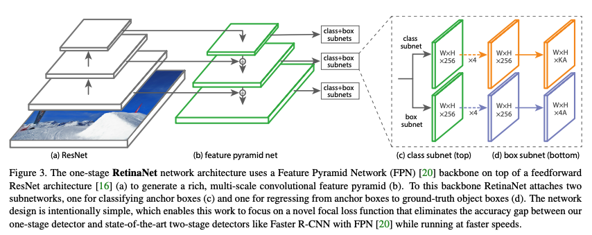
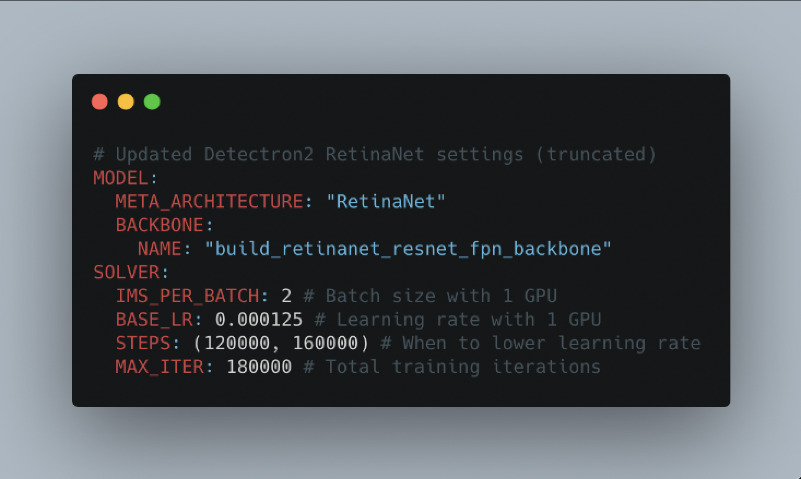
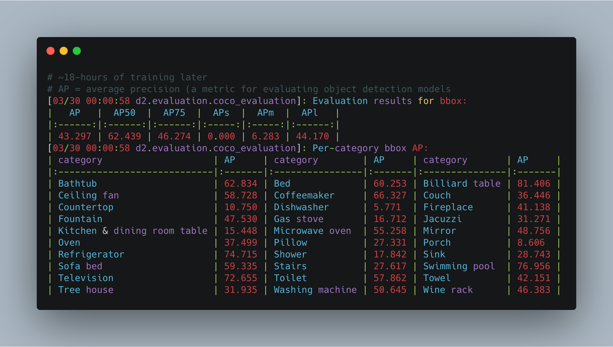

# Amenity Detection
This project provides script to download images and labels from OpenImageV5 dataset and trains a object detection model to detect amenities in the images.

<br>

## Installing Dependencies
```bash
pip install -r requirements.txt
```

<br>

## Download Dataset From OpenImageV5
OpenImageV5: https://storage.googleapis.com/openimages/web/download_v5.html

```bash
cd data_collection

bash get_openImage_labels.sh # download labels

python3 get_openImage_images.py --classes 'Bathtub,Bed,Billiard table,Ceiling fan,Coffeemaker,Couch,Countertop,Dishwasher,Fireplace,Fountain,Gas stove,Jacuzzi,Kitchen & dining room table,Microwave oven,Mirror,Oven,Pillow,Porch,Refrigerator,Shower,Sink,Sofa bed,Stairs,Swimming pool,Television,Toilet,Towel,Tree house,Washing machine,Wine rack' --dataset train # download training images

python3 get_openImage_images.py --classes 'Bathtub,Bed,Billiard table,Ceiling fan,Coffeemaker,Couch,Countertop,Dishwasher,Fireplace,Fountain,Gas stove,Jacuzzi,Kitchen & dining room table,Microwave oven,Mirror,Oven,Pillow,Porch,Refrigerator,Shower,Sink,Sofa bed,Stairs,Swimming pool,Television,Toilet,Towel,Tree house,Washing machine,Wine rack' --dataset validation # download validation images
```

<br>

## Object Detection Model: ([paper](https://arxiv.org/pdf/1708.02002v2.pdf))
We will use [Detectron2](https://detectron2.readthedocs.io/en/latest/tutorials/getting_started.html) to train the `retinanet_R_50_FPN_3x` object detection model


<br>

## Data Explaination
```json
//Example of a label required by Detectron2 for image "1e2c50b991a82ee8.jpg"
[
  {
    "annotations": [
      {
        "bbox": [228.0, 12.0, 791.0, 858.0],
        "bbox_mode": "<BoxMode.XYXY_ABS: 0>", // needs to be parse into detectron2.structures.BoxMode object
        "category_id": 0
      }
    ],
    "file_name": "labels/train/1e2c50b991a82ee8.jpg", //this will change depending on where your images are stored
    "height": 867,
    "image_id": 33,
    "width": 1024
  }
]
```

* `annotations` (list): all of the annotations (labels) on an image, a single image may have more than one of these. For object detection (our use case), it contains:
  * `bbox` (list of int): the coordinates in pixel values of a bounding box.
  * `bbox_mode` (Enum): the order and scale of the pixel values in `bbox`, [see more in the docs](https://detectron2.readthedocs.io/modules/structures.html#detectron2.structures.BoxMode).
  * `category_id` (int): the numerical mapping of the category of the object inside `bbox`, example `{coffeemaker:0, fireplace:1, ...}`.
* `file_name` (str): string filepath to target image.
* `height` (int): height of target image.
* `width` (int): width of target image.
* `image_id` (int): unique image identifier, used during evaluation to identify images.

<br>

## Preprocess Data
Run following command to convert OpenImageV5 annotations to the format required by Detectron2. The converted json file will be store in the same directory as the iamge files.
```bash
python3 preprocess.py
```

<br>

## Dataset Statistics
- `34,835` training images
- `3,353` test images

<br>

## Model Configs


<br>

## Model Training
**Require Completion of Following Steps**:
- [Installing Dependencies](#installing-dependencies)
- [Download Dataset From OpenImageV5](#download-dataset-from-openimagev5)
- [Preprocess Data](#preprocess-data)

Follow the steps on `train_amenity_detection.ipynb` notebook to train the model. The trained model will be stored in `outputs/` folder.

<br>

## Training Metrics


<br>

## Sagemaker Remote Deployment using Docker Image and AWS ECR
follow steps in [deploy_detectron2.ipynb](sagemaker_deployment/deploy_detectron2.ipynb) to deploy your model on Sagemaker

<br>
<br>
<br>

## TODOs:
- [x] get data from openImageV5
- [x] filter data with required classes
- [x] preprocess data for Detectron2 model
- [x] implement training script
- [x] train model on full dataset on google colab
- [x] implement inference code for aws lambda
- [x] get the input request data format and integrate with the inference lambda function
- [x] test lambda function with aws sagemaker endpoint using docker